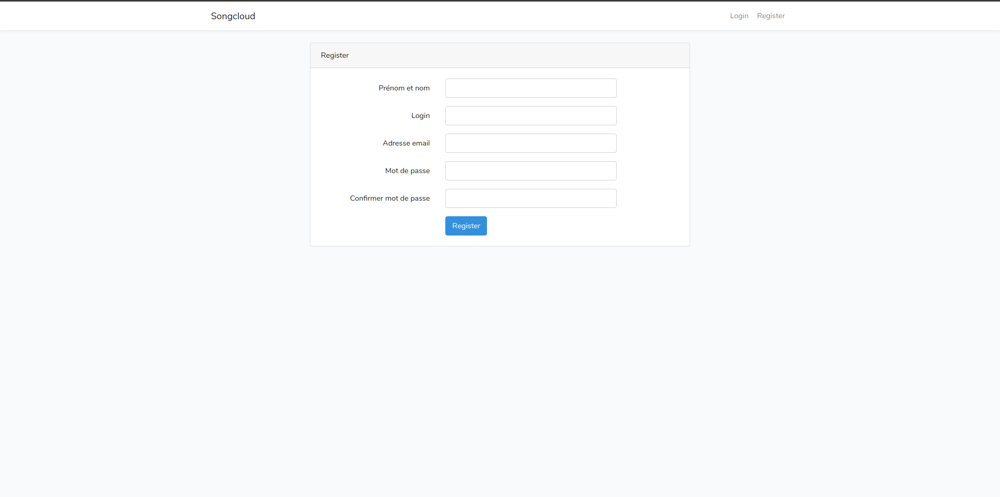
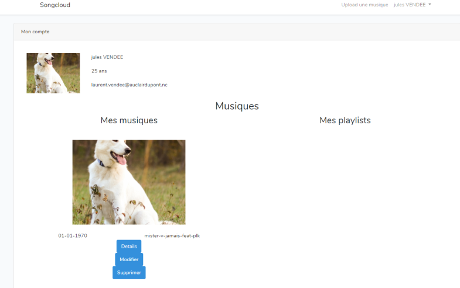
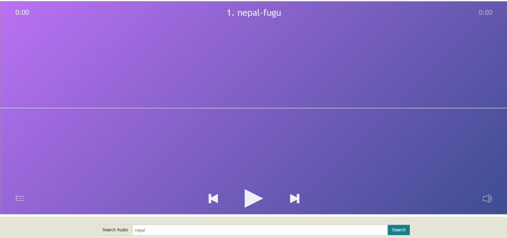

# Projet E-SHOP

## Notation

Le projet sera un site soundcloud-like, avec CRUD utilisateur, un systeme d'upload de musique, de note, de playlist de favoris, de catégorisation, 
envoi d'email lorsque une certaine musique est upload.

Le projet va se composer :  
* d’une base de données
* d’un système d’authentification : 5 points
Les utilisateurs peuvent se créer un compte et se connecter. Ils pourront compléter et modifier leur profil. Chaque profil utilisateur possède :
    * un prénom
    * un nom
    * une adresse email
    * une date de naissance 

* d'une page-produit pour chaque musique qui contient : difficulté : 7
    * une image
    * le nom de la musique
    * le prix 
    * la note moyenne
    * un bouton d’ajout au favoris

* un email automatique est envoyé à l’utilisateur quand qlqun poste une musique avec : difficulté : 5
    * les infos de la nouvelle musique
    * le lien vers la nouvelle musique

* des pages permettant à l’utilisateur de : difficulté : 5
    * upload une musique 
    * gérer le contenu (CRUD : modifier données genre titre, ect)

* un espace administrateur est mis en place avec une authentification difficulté : 3

* les administrateurs peuvent gérer les musique avec un CRUD : difficulté : 5
    * le CRUD permet d'ajouter/modifier/supprimer une musique avec :
        * un nom
        * une description
        * une image

## Livrable

La page d'acceuil du site recense tous les morceaux disponibles.
D'ici, vous pouvez donc lire les musiques qui sont déjà téléchargées.
Vous pouvez vous inscrire en cliquant sur l'onglet Register ou cliquer sur l'onglet Login, sauf qu'aucun compte n'est déjà enregistré.

La base de données intègre principalement *evenements* qui recense toutes les musiques (id, titre, durée, date d'upload, tags, auteur), *users* où chaque compte sera enregistré et *password_reset* où chaque mot de passe est enregistré sous forme de hash.

Les fonctionnalités majeures du site sont d'upload n'importe quel type de musique ou de fichier audio en .mp3 une fois que l'utilisateur a un compte enregistré, de pouvoir le modifier, le supprimer depuis sa page Compte.

